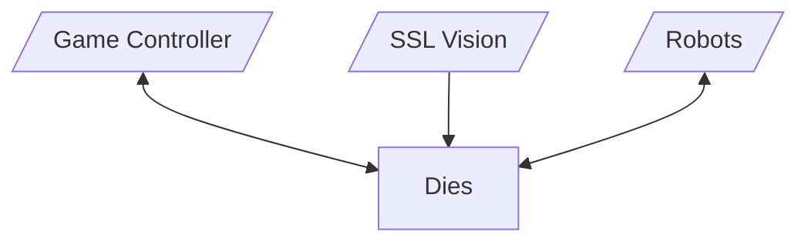
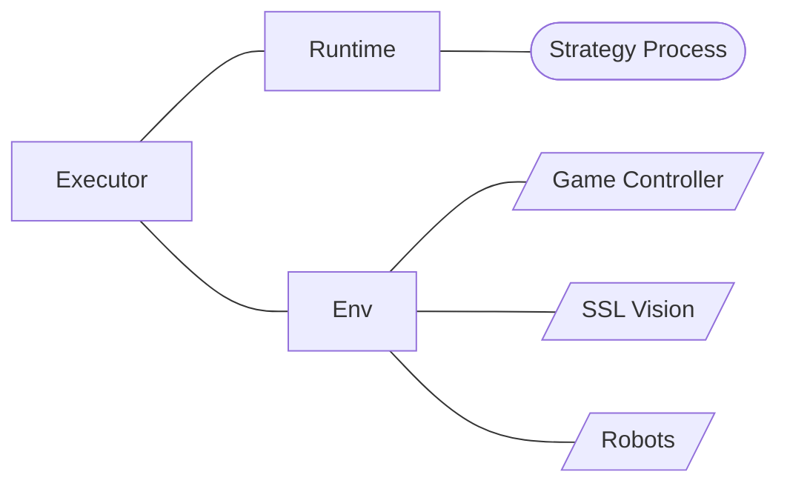
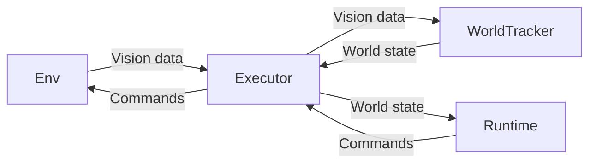

# Dies Architecture

Dies is Delft Mercurians' open source framework for building AIs, specifically the central team controller, for RoboCup Small Size League.

Dies runs on a central server, and communicates with the tournament software (ssl-vision/simulator, game controller), and with the robots on the field. It is responsible for running the AI, and for sending commands to the robots.

## Overview

Dies is desigend to be modular and flexible, allowing for easy integration of new features and algorithms. At its core is the `Executor`, which is responsible for setting up the environment, running the AI, processing incoming data, communicating with the game controller and with the robots on the field or a simulator.

The executor is relies on two generic components to talk to the outside world: the `Env` (see [Environment](#the-environment)) and the `Runtime` (see [Runtime](#the-runtime)). The `Env` is responsible for setting up the environment, which includes the game controller, the robots, and the simulator, and sending/receiving messages to/from these. The `Runtime` is responsible for starting up and talking to the AI (aka. strategy), which runs in a separate process.

Both the runtime and the excutor can have multiple implementations. Their interfaces are defined as traits in `dies-core`.

The executor calls a number of other components to process data and to execute lower level behavior on the robots (skills). These are not generic, as we do not expect to use multiple implementations of these.

Incoming data from the Env is passed by the executor for processing to the `WorldTracker` (`dies-world`). This is essentially a stateful filter which keeps track of the world state -- including the position of the robots, the ball, the game state, the field, etc. --, computes derived state such as velocities, removes noise, and provides a simple interface for the executor to query this state.

Therefore, the overall data flow looks like this:

_TODO: describe skills_

## The Runtime

For details of the runtime interface see [`crates/dies-core/src/runtime.rs`](../crates/dies-core/src/runtime.rs).

The runtime is responsible for starting up the AI and communicating with it. It is implemented as a separate process, which allows for the AI to be written in any language, and also increases stability, as a crash in the AI will not crash the executor.

Runtime implementations should assume as little as possible about the host system. For example, they should not rely on a local Python installation. They should work well on all major desktop operating systems (Windows, Linux, macOS).

After starting up the AI process, the runtime creates a TCP socket to which the child process can connect. The runtime then receives updates to the world state from the executor, and relays them to the AI. The AI can send commands back to the runtime, which will relay them to the executor.

The runtime monitors the child process for crashes, and reports these to the Executor, which, depending on configuration, may restart the AI process.

Currently, the following implementations are available or are planned:

- Python (`dies-python-rt`) - runs a Python strategy

## The Environment

For details of the environment interface see [`crates/dies-core/src/env.rs`](../crates/dies-core/src/env.rs).

The environment is responsible for setting up connections to the game controller, the simulator, and the robots, and for sending/receiving messages to/from these. This abstraction allows dies to support running in different environments, such as the ER Sim, the RoboCup tournament, or our own simulator.

Just like the runtime, env implementations should assume as little as possible about the host system. They should work well on all major desktop operating systems (Windows, Linux, macOS).

When running a simulation (eg. ER Sim), the environment is responsible for starting up the simulator, game controller, and an autoref. It is also responsible for properly cleaning up after the simulation is finished.

Currently, the following implementations are available or are planned:

- ER Sim (`dies-ersim-env`) - runs a simulation in the ER Sim
- Tournament (_planned_) - env for running a real match against other teams
- DieSim (_planned_) - env for our custom simulator
- Robot Test (_planned_) - env for testing on one or more of our own robots on a real field, but not during a match

## Skills

_TODO: describe skills_
