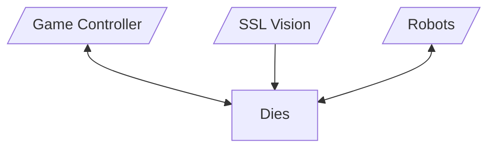
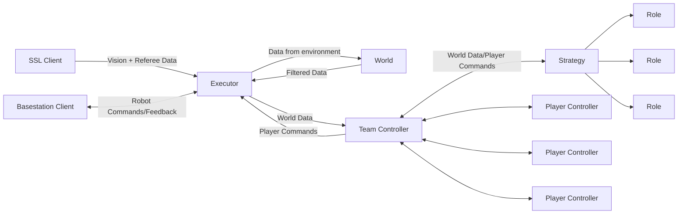

# Dies Architecture

Dies is Delft Mercurians' open source framework for building AIs, specifically the central team controller, for RoboCup Small Size League.

Dies runs on a central server, and communicates with the tournament software (ssl-vision/simulator, game controller), and with the robots on the field. It is responsible for running the AI, and for sending commands to the robots.

## Overview

Dies is desigend to be modular and flexible, allowing for easy integration of new features and algorithms. At its core is the `Executor`, which is responsible for setting up the environment, running the AI, processing incoming data, communicating with the game controller and with the robots on the field or a simulator.

The executor interfaces with the world through the `SSLClient`, which is responsible for communicating with the game controller and the SSL Vision, and with the `BasestationClient` (aka. base station client), which is responsible for communicating with the robots.

Data coming from the vision is processed by `World`, which is responsible for keeping track of the state of the game world, and for filtering and processing incoming data.

The behavior of the players is determined by the `TeamController`. This in turn creates a `PlayerController` and a `Role` for each player, with the former handling lower level control (position, heading, failsafes) and the latter dealing with strategy and tactics. The TeamController also uses a `Strategy` instance to determine the assignment of `Role`s depending on the current game state.

`Role`s function as actors in an actor model. They can be run concurrently and make independent decisions. They can also communicate with each other through the `TeamController`.

`Role`s can in turn use _skills_ to perform common reusable and composable tasks, such as moving to a position, or kicking the ball.

## Crates

Dies is split into several crates, each with a specific purpose:

- `dies-core`: Contains the most widely used types and traits. Should be kept slim.
- `dies-team`: Contains the `Executor`, `TeamController`, `PlayerController`, `Role`, and `Strategy` types.
- `dies-basestation-client`: Contains the `BasestationClient` type.
- `dies-ssl-client`: Contains the `SSLClient` type.
- `dies-protos`: Contains the protobuf definitions used for communication with the game controller and vision.
- `dies-simulator`: Contains the `Simulator` type, which can be used to replace the `SSLClient` and `BasestationClient` with a simulator for testing.
- `dies-tracker`: Contains the `World` type, which is used to represent the state of the game world, as well as filters and processors for incoming data.
- `dies-webui`: Contains the backend for the web interface, which can be used to monitor and control the AI. The frotend is in the `webui` directory.
- `dies-cli`: Contains the command line interface for running the AI. This is the main entry point for the framework.
