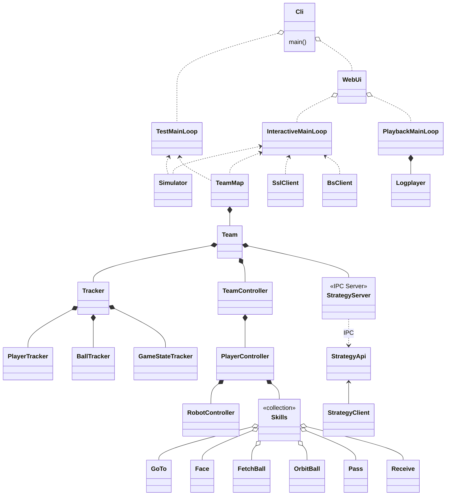
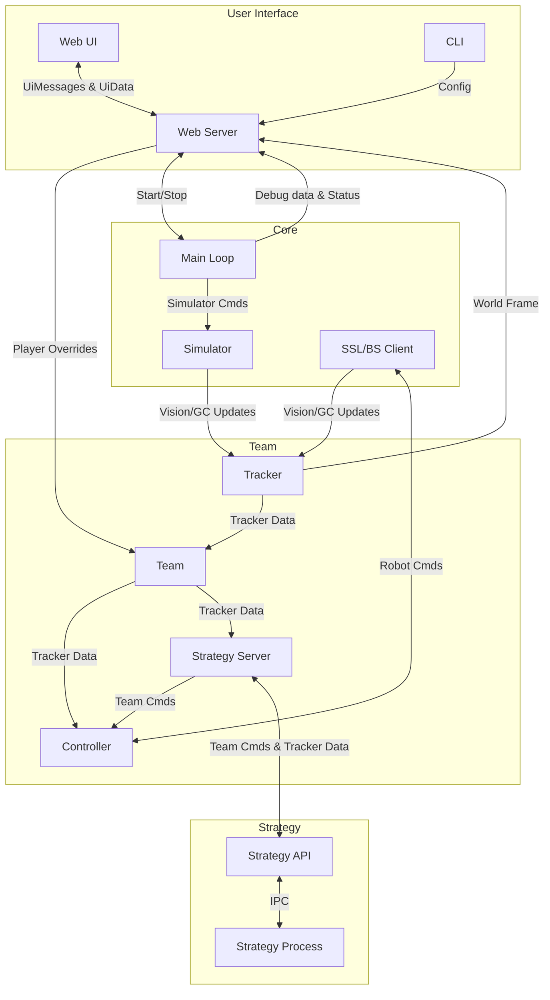
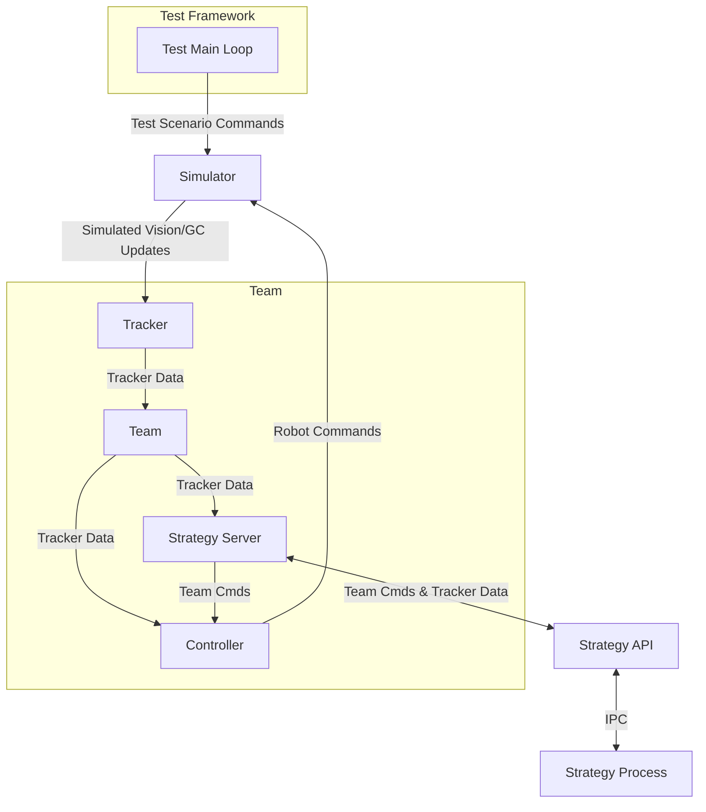

<!-- - InteractiveMainLoop
  - UiMessage
  - UiUpdate
  - Simulator
  - SslClient
    - VisionMsg
    - RefereeMsg
  - BsClient
    - RobotCmd
    - RobotFeedback
  - Tracker
    - PlayerTracker
      - PlayerModel
    - BallTracker
      - BallModel
    - GameStateTracker
    - World (TrackerData)
      - Player
      - Ball
      - Field
      - GameState
  - TeamMap
    - Team
      - TeamController
        - PlayerController
          - RobotController
          - Skills
            - GoTo
            - Face
            - FetchBall
            - OrbitBall
            - Pass
            - Receive
        - TeamCmd
      - StrategyServer
- StrategyClient
  - StrategyApi
- TestMainLoop
- PlaybackMainLoop -->

## Framework Component Relationships

    
Legend

    <ul>
        <li>A `*--` B: Ownership (A can only exist as part of B)</li>
        <li>A `o..` B: Aggregation (A owns B, but B can exist independently)</li>
        <li>A `<..` B: Dependency (A does not store B, but makes use of it)</li>
    </ul>

## Data Flow

**Interactive Mode (simulation or live)**

**Test Mode (automated)**

